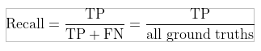

# Pedestrian and Car Detector

The main aim of the project is to detect Pedestrian and car on a road.

## Model Names

1.  EfficientDet D0.
2.  SSD MobileNet V2.

## Links to dataset and framework

**TensorFlow Object Detection API**

Creating accurate machine learning models capable of localizing and identifying multiple objects in a single image remains a core challenge in computer vision. The [TensorFlow Object Detection API](https://github.com/tensorflow/models/tree/master/research/object_detection) is an open source framework built on top of TensorFlow that makes it easy to construct, train and deploy object detection models.

**_Dataset Details:_**

Number of images: 2239

Size: 750 MB (approx.)

Categories: 2 (person and car)

Annotation format: COCO

Data directory structure:

  

Link to Dataset: [https://evp-ml-data.s3.us-east-2.amazonaws.com/ml-interview/openimages-personcar/trainval.tar.gz](https://evp-ml-data.s3.us-east-2.amazonaws.com/ml-interview/openimages-personcar/trainval.tar.gz)

## Model Description

**EfficientDet :**
The EfficientDet architecture was written by Google Brain. EfficientDet s built on top of EfficientNet, a convolutional neural network that is pretrained on the ImageNet image database for classification. EfficientDet pools and mixes portions of the image at given granularities and forms features that are passed through a NAS-FPN feature fusion layer. The NAS-FPN combines various features at varying granularities and passes them forward to the detection head, where bounding boxes and class labels are predicted.

EfficientDets are a family of object detection models, which achieve state-of-the-art 55.1mAP on COCO test-dev, yet being 4x - 9x smaller and using 13x - 42x fewer FLOPs than previous detectors. Our models also run 2x - 4x faster on GPU, and 5x - 11x faster on CPU than other detectors.

EfficientDets are developed based on the advanced backbone, a new BiFPN, and a new scaling technique:

  

- Backbone: we employ EfficientNets as our backbone networks.
- BiFPN: we propose BiFPN, a bi-directional feature network enhanced with fast normalization, which enables easy and fast feature fusion.
- Scaling: we use a single compound scaling factor to govern the depth, width, and resolution for all backbone, feature & prediction networks.

The model family starts from EfficientDet-D0, which has comparable accuracy as YOLOv3. Then we scale up this baseline model using our compound scaling method to obtain a list of detection models EfficientDet-D1 to D6, with different trade-offs between accuracy and model complexity.

  

  

**Pretrained EfficientDet Checkpoints**

  

**Ssd_mobilenet_v2_fpnlite_320x320**

Released in 2019, this model is a single-stage object detection model that goes straight from image pixels to bounding box coordinates and class probabilities. The model architecture is based on inverted residual structure where the input and output of the residual block are thin bottleneck layers as opposed to traditional residual models. Moreover, nonlinearities are removed from intermediate layers and lightweight depthwise convolution is used. This model is part of the Tensorflow object detection API.

SSD with Mobilenet v2 FPN-lite feature extractor, shared box predictor and focal loss (a mobile version of [Retinanet in Lin et al](https://arxiv.org/abs/1708.02002)) initialized from Imagenet classification checkpoint.

Trained on [COCO 2017](https://cocodataset.org/) dataset (images scaled to 320x320 resolution).

  

## Primary Analysis

On analyzing the given dataset we can infer the following:

1.  The training dataset has images that are of lower resolution.
2.  It also consists of tiny, blurred objects which are not so clear but are marked as an object.

## Assumptions

1.  Most of the images in dataset are clear enough and properly annotated.

Model is trained within default parameter.

## Approach

1.  Dataset is converted from Coco format to pascal format for training tensor flow object detection.
2.  Training:

3.  SSD MobileNet V2:

4.  Used pre-trained checkpoints for initialization and then trained it using our own dataset for 2 classes.
5.  Used default parameters

6.  EfficientDet d0

7.  Used [Kmeans algorithm](https://github.com/mnslarcher/kmeans-anchors-ratios) to find the optimal value for the anchor ratio.
8.  Trained efficientdet d0 for data having 2 classes

## Inference

  

## Metrics

[**Intersection Over Union (IOU)**](https://github.com/rafaelpadilla/Object-Detection-Metrics)

Intersection Over Union (IOU) is a measure based on Jaccard Index that evaluates the overlap between two bounding boxes. It requires a ground truth bounding box and a predicted bounding box . By applying the IOU we can tell if a detection is valid (True Positive) or not (False Positive).

IOU is given by the overlapping area between the predicted bounding box and the ground truth bounding box divided by the area of union between them:

  

The image below illustrates the IOU between a ground truth bounding box (in green) and a detected bounding box (in red).

  

True Positive, False Positive, False Negative and True Negative

Some basic concepts used by the metrics:

- True Positive (TP): A correct detection. Detection with IOU ≥ threshold
- False Positive (FP): A wrong detection. Detection with IOU < threshold
- False Negative (FN): A ground truth not detected
- True Negative (TN): Does not apply. It would represent a corrected misdetection. In the object detection task, there are many possible bounding boxes that should not be detected within an image. Thus, TN would be all possible bounding boxes that were correctly not detected (so many possible boxes within an image). That's why it is not used by the metrics.

threshold: depending on the metric, it is usually set to 50%, 75% or 95%.

**Precision**

Precision is the ability of a model to identify only the relevant objects. It is the percentage of correct positive predictions and is given by:

  

**Recall**

Recall is the ability of a model to find all the relevant cases (all ground truth bounding boxes). It is the percentage of true positive detected among all relevant ground truths and is given by:

  

**Result**

Average Precision for Person:

  

Average Precision for Car:

  

**Mean Average Precision : 73.87%**

## Conclusion

For object detection , I used 2 different algorithms namely Effiecientdet d0 and ssd mobilnet v2. **Due to less powerful resources in the present environment, both models were run with less number of epochs than required, thus the resultant was not very accurate as it could be with more powerful resources**.Both these models are able to perform the same task however Efficientdet is heavier and slower compared to the other and thus it’s not suitable to be deployed on embedded systems. On the other side ssd mobilnet v2 is very light on the system comparatively and even can be used in embedded systems as well and greatly increases the number of possible use cases. Comparing both the results from the algorithms, ssd mobilnet v2 performed better with better accuracy.

## Recommendations

Here are few of the recommendations for the given project:

1.  Getting high quality dataset with higher resolution and higher number of samples.
2.  Using more resource-intensive ML Models that can get better results without the constraint of low resource environments like embedded systems.
